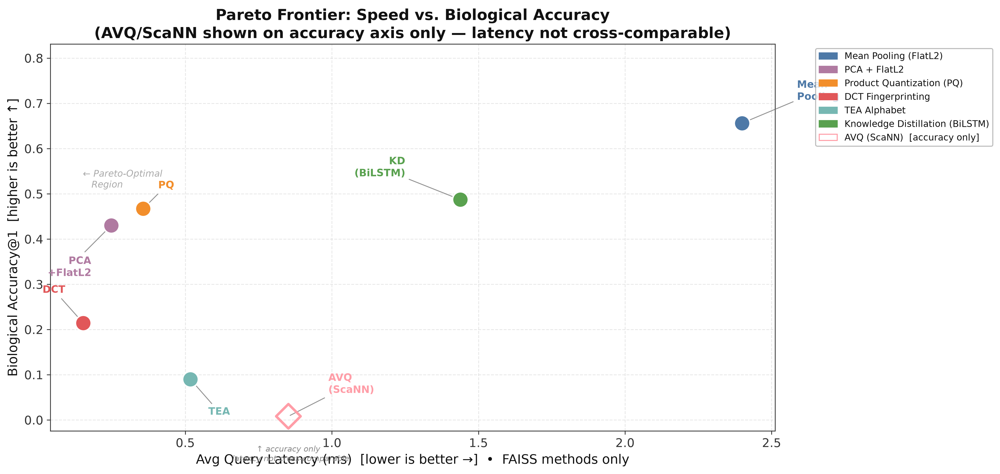

# Empirical Evaluation of ESM-2 Embedding Compression Strategies for Scalable Protein Sequence Retrieval Using FAISS

**Preliminary Study — Seminar Project**
Master of Information Technology (MIT), Miva Open University

---

## Overview

This repository contains the full experimental codebase for a preliminary empirical study benchmarking seven compression strategies applied to protein sequence embeddings generated by the ESM-2 650M language model (Facebook/Meta AI). The compressed embeddings are indexed with FAISS and evaluated against two ground-truth metrics: mathematical ANN Recall@10 and biological Accuracy@1 (BA@1) based on SCOPe 2.08 Superfamily co-membership.

The central research question is: **how much can ESM-2 protein embeddings be compressed before retrieval quality meaningfully degrades, and which compression strategy offers the best speed-accuracy tradeoff at scale?**

---

## Compression Strategies Evaluated

| # | Strategy | Method | Output Dim |
|---|----------|--------|-----------|
| 1 | **Mean Pooling (Baseline)** | No compression — FlatL2 exact search | 1,280 |
| 2 | **PCA + FlatL2** | Top-64 eigenvectors of sample covariance | 64 |
| 3 | **Product Quantization (PQ)** | FAISS IndexPQ | 1,280 (quantized) |
| 4 | **DCT Fingerprinting** | SciPy Type-II DCT, first 64 coefficients | 64 |
| 5 | **TEA Alphabet** | K-Means vector quantisation, 20-dim histogram | 20 |
| 6 | **Knowledge Distillation (KD)** | BiLSTM student trained via MSE against ESM-2 | 256 |
| 7 | **Anisotropic Vector Quantisation (AVQ)** | Google ScaNN | 1,280 (quantized) |

---

## Evaluation Metrics

- **ANN Recall@10** — For each query, the exact Top-10 nearest neighbours from the uncompressed FlatL2 index define the ground truth. A query is successful if the compressed index returns at least one of those same Top-10 proteins. *(Protocol: ann-benchmarks standard, Aumuller et al., 2020).*
- **Biological Accuracy@1 (BA@1)** — A query is successful if its Top-1 retrieved result belongs to the same SCOPe 2.08 Superfamily as the query, parsed directly from FASTA headers. *(Precedent: TM-Vec, Hamamsy et al., 2022).*
- **Query Latency** — Compression time + FAISS search time per query. ESM-2 inference is excluded per methodology.

---

## Dataset

- **Source:** SCOPe ASTRAL 2.08, 40% sequence identity subset
- **Database:** 10,000 protein sequences (`scope_10k_subset.fasta`)
- **Queries:** 1,000 held-out protein sequences (`queries_1000.fasta`)
- **Embeddings:** ESM-2 650M (`facebook/esm2_t33_650M_UR50D`) — residue-level, mean-pooled to fixed-size vectors

> **Note:** The `data/` and `results/` directories are excluded from this repository (see `.gitignore`). Data files are downloaded or uploaded to the execution environment directly. Results are generated fresh at runtime.

---

## Repository Structure

```
codebase/
├── 01_offline_build.py        # Stage 1 entry point: data prep → embeddings → indexing
├── 02_online_eval.py          # Stage 2 entry point: query evaluation against all indices
├── 03_run_analysis.py         # Stage 3 entry point: statistical tests + figures
│
├── src/
│   ├── 01_prepare_data.py         # Downloads SCOPe FASTA; creates 10k DB + 1k query split
│   ├── 02_generate_embeddings.py  # ESM-2 650M forward pass, saves per-residue embeddings
│   ├── 03_offline_indexing.py     # Builds FAISS indices for strategies 1-6
│   ├── 03b_offline_indexing_avq.py # Builds ScaNN AVQ index (strategy 7, Linux-native)
│   ├── 04_online_inference.py     # Runs 1,000 queries; records latency, ANN recall, BA@1
│   ├── 04b_online_inference_avq.py # Same evaluation for ScaNN AVQ index
│   └── 05_statistical_analysis.py # Wilcoxon tests, Pareto plots, tradeoff figures
│
├── requirements.txt           # All dependencies (GPU build, Linux)
├── .gitignore
└── README.md
```

---

## Requirements

- **OS:** Linux (required for ScaNN/AVQ; run on a GPU cloud instance such as vast.ai)
- **GPU:** CUDA-enabled, > 16 GB VRAM recommended (RTX 3090 / RTX 4090 / A100 / L40)
- **Python:** 3.10 or 3.11

### Installation

Install PyTorch with CUDA support first, then all project dependencies:

```bash
# Step 1: Install PyTorch (CUDA 12.1 build)
pip install torch torchvision --index-url https://download.pytorch.org/whl/cu121

# Step 2: Install all project dependencies
pip install -r requirements.txt
```

### Dependencies

| Package | Purpose |
|---------|---------|
| `torch`, `torchvision` | ESM-2 inference and KD BiLSTM training |
| `transformers` | HuggingFace ESM-2 model and tokenizer |
| `faiss-gpu` | GPU-accelerated vector index building and search |
| `scann` | Google ScaNN AVQ index (Linux-native) |
| `numpy`, `scipy` | Numerical operations, DCT |
| `scikit-learn` | PCA, MiniBatchKMeans (TEA codebook) |
| `joblib` | Model serialisation |
| `pandas` | Results aggregation |
| `matplotlib` | Figure generation |
| `requests` | SCOPe FASTA download |

---

## Running the Pipeline

All three stages are run sequentially from the root of the repository.

### Stage 1 — Offline Build

Downloads data, generates ESM-2 embeddings, and builds all seven indices.

```bash
python 01_offline_build.py
```

| Sub-script | Task |
|--------|------|
| `src/01_prepare_data.py` | Downloads SCOPe FASTA; splits into 10k DB + 1k queries |
| `src/02_generate_embeddings.py` | Generates ESM-2 embeddings for all 10k sequences |
| `src/03_offline_indexing.py` | Builds FAISS indices for strategies 1-6 |
| `src/03b_offline_indexing_avq.py` | Builds ScaNN AVQ index (strategy 7) |

**Outputs to `data/`:**
- `scope_10k_subset.fasta`, `queries_1000.fasta`
- `raw_embeddings_10k.pt` (~9 GB)
- `mean_pooled_10k.npy`, `pca_model.pkl`, `tea_kmeans_codebook.pkl`, `kd_student.pt`
- `indices/` — seven FAISS/ScaNN index files

---

### Stage 2 — Online Evaluation

Runs all 1,000 queries against all seven indices; records latency, ANN Recall@10, and BA@1.

```bash
python 02_online_eval.py
```

**Outputs to `results/`:**
- `benchmark_results.csv` — per-strategy summary (strategies 1-6)
- `benchmark_avq.csv` — ScaNN AVQ summary
- `indexing_results.csv`, `raw_latencies.csv`, `raw_ann_hits.csv`, `raw_bio_hits.csv`
- AVQ equivalents: `raw_latencies_avq.csv`, `raw_ann_hits_avq.csv`, `raw_bio_hits_avq.csv`

---

### Stage 3 — Statistical Analysis

Runs Wilcoxon signed-rank tests and generates all figures.

```bash
python 03_run_analysis.py
```

**Outputs to `results/`:**
- `wilcoxon_results.csv` — Wilcoxon p-values (latency and BA@1; significance threshold α = 0.05)
- `full_results.csv` — merged summary with compression ratios

**Outputs to `results/figures/`:**
- `pareto_speed_vs_accuracy.png`
- `tradeoff_ann_vs_compression.png`
- `tradeoff_bio_vs_compression.png`
- `latency_boxplot.png`

---

## Technical Notes

**ESM-2 lowercase bug fix:** The SCOPe ASTRAL FASTA stores sequences in lowercase. The ESM-2 tokenizer requires uppercase amino acid codes; lowercase characters are silently mapped to `<unk>`, collapsing all embeddings to the same unknown-token vector. `src/02_generate_embeddings.py` applies `.upper()` to all sequences before tokenisation. Any embeddings generated without this fix are invalid and must be discarded.

**AVQ latency policy:** ScaNN AVQ query latency is recorded in `raw_latencies_avq.csv` but excluded from Wilcoxon latency comparisons and the Pareto speed axis. ScaNN throughput reflects engine-level SIMD engineering, not the AVQ quantisation algorithm itself. All accuracy metrics are fully cross-comparable across all seven strategies.

**Batch size:** Set to `32` in `src/02_generate_embeddings.py`, optimised for GPUs with > 16 GB VRAM. Reduce to `16` if running on a card with exactly 16 GB VRAM.

---

## Author

**Bruno Chike Nwagbo**
Master of Information Technology (MIT), Miva Open University

---

## Results

The full pipeline was successfully executed on a vast.ai cloud GPU instance (NVIDIA GeForce RTX 4090, 24 GB VRAM; AMD Ryzen 5 5600X; 62 GiB RAM). All seven compression strategies were evaluated across 1,000 held-out SCOPe 2.08 query proteins.

### Benchmark Summary

| Method | ANN Recall@10 | Biological Accuracy@1 | Avg Latency (ms) | Index Size (GB) | Compression Ratio |
|--------|:---:|:---:|:---:|:---:|:---:|
| **Mean Pooling (FlatL2 — Baseline)** | 1.000 | **0.656** | 2.399 | 0.0477 | 1.0× |
| PCA + FlatL2 | 0.999 | 0.430 | **0.248** | 0.0024 | 20.0× |
| Product Quantization (PQ) | 0.997 | 0.467 | 0.357 | 0.0015 | 31.4× |
| DCT Fingerprinting | 0.266 | 0.214 | 0.152 | 0.0024 | 20.0× |
| TEA Alphabet | 0.425 | 0.090 | 0.517 | 0.0007 | **64.0×** |
| Knowledge Distillation (BiLSTM) | 0.994 | **0.487** | 1.438 | 0.0095 | 5.0× |
| AVQ (ScaNN)† | 0.043 | 0.008 | 0.060† | 0.0548 | 0.87× |

> **†** AVQ latency reflects ScaNN engine engineering, not the AVQ algorithm itself. Excluded from Pareto speed comparisons.

### Key Findings

**1. ESM-2 embeddings natively capture protein structure.**
The uncompressed FlatL2 baseline achieved **65.6% Biological Accuracy@1** — meaning in 656 out of 1,000 queries, the single closest neighbour belonged to the same SCOPe 2.08 Superfamily as the query, with no domain-specific tuning whatsoever. This establishes that raw mean-pooled ESM-2 embeddings are a high-quality biological signal, not just a generic vector representation.

**2. Knowledge Distillation best preserves biological fidelity.**
At 5× compression, the BiLSTM student model retained **48.7% BA@1** — the highest among all compressed methods. Its MSE training objective explicitly forces the student to stay geometrically close to the ESM-2 embedding space, explaining why it preserves biological signal better than any geometric compression technique.

**3. PCA and PQ sit on the Pareto frontier.**
PCA + FlatL2 achieves **43.0% BA@1** at just **0.25 ms** average latency and 20× compression. Product Quantization achieves **46.7% BA@1** at **0.36 ms** and 31.4× compression. Both occupy the Pareto-optimal region — no other method outperforms them on both speed and biological accuracy simultaneously.

**4. DCT Fingerprinting fails on both axes.**
Despite being the fastest method (0.15 ms), DCT collapsed ANN Recall@10 to just **26.6%** and BA@1 to **21.4%**. Speed gains are irrelevant if the retrieval results are biologically wrong. DCT is Pareto-dominated by PCA on every meaningful metric.

**5. AVQ (ScaNN) underperformed across all metrics.**
AVQ achieved only **0.8% BA@1** and **4.3% ANN Recall@10**, while producing an index *larger* than the uncompressed baseline (0.87× compression ratio). The anisotropic quantization objective is mismatched to the geometric distribution of ESM-2 protein embeddings.

### Pareto Frontier

The Pareto analysis (speed vs. biological accuracy) identifies **PCA + FlatL2** and **Product Quantization** as jointly Pareto-optimal for general use. Knowledge Distillation is optimal when maximum biological fidelity is the priority. DCT, TEA, and AVQ are all Pareto-dominated.



*Pareto frontier of query latency (lower is better) vs. Biological Accuracy@1 (higher is better). PCA + FlatL2 and PQ occupy the Pareto-optimal upper-left region. AVQ plotted on accuracy axis only (latency not cross-comparable).*

### Statistical Validation

All pairwise latency comparisons versus the FlatL2 baseline were confirmed statistically significant (Wilcoxon signed-rank test, p < 0.05). All biological accuracy changes versus baseline were also statistically significant (p < 0.05 across all methods), confirming that the degradation in BA@1 under compression is not due to random variation.

Detailed W-statistics and p-values are in [`results/wilcoxon_results.csv`](results/wilcoxon_results.csv). Full merged results with compression ratios are in [`results/full_results.csv`](results/full_results.csv).
